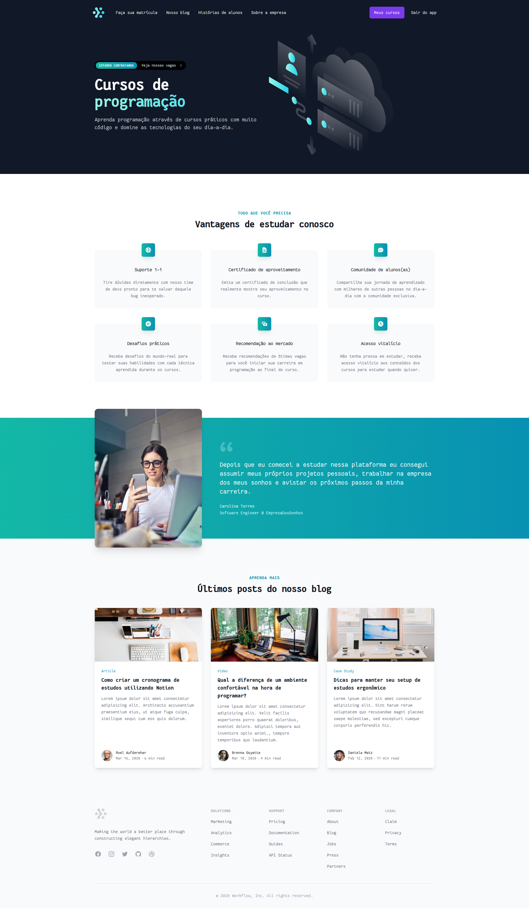

# Ignite Lab



- Auth0
- NestJS
- GraphQL
- Apache Kafka
- Next.js
- Apollo Client (GraphQL)

## Functionalities

### Purchases Microservice

- [Admin] Register product
- [Admin] List products

- [Auth] List purchases

- [Public] Purchase a product
- [Public] List of products available for purchase

### Classroom Microservice

- [Admin] List enrollments
- [Admin] List students
- [Admin] List courses
- [Admin] Register course

- [Auth] List courses I have access to
- [Auth] Access course content

### Run project

```bash
$ https://github.com/Sup3r-Us3r/ignite-lab-microservices-project.git
$ cd ignite-lab-microservices-project
$ docker-compose up -d

// Inside the classroom microservice run:
$ cd classroom
$ npm run start:dev // or yarn start:dev

// Inside the purchases microservice run:
$ cd purchases
$ npm run start:dev // or yarn start:dev

// Inside the apollo gateway run:
$ cd gateway
$ npm run start:dev // or yarn start:dev

// Inside the web (frontend) run:
$ cd web
$ npm run dev // or yarn dev
```
